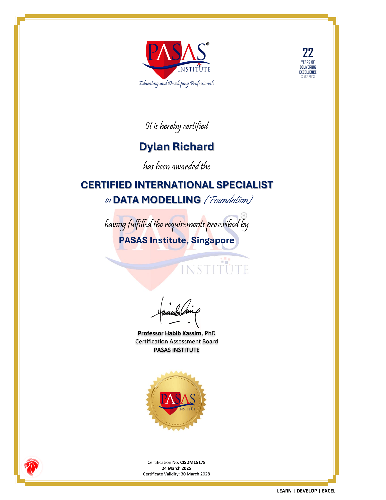

# Certified-International-Specialist-in-Data-Modeling
Pasas Institute | Valid: March 2025 – March 2028

Demonstrated proficiency in data modeling concepts, including data structure design, data relationships, normalization, and analytical data frameworks. Equipped with skills to organize, model, and prepare data for business intelligence, reporting, and data-driven decision-making.

